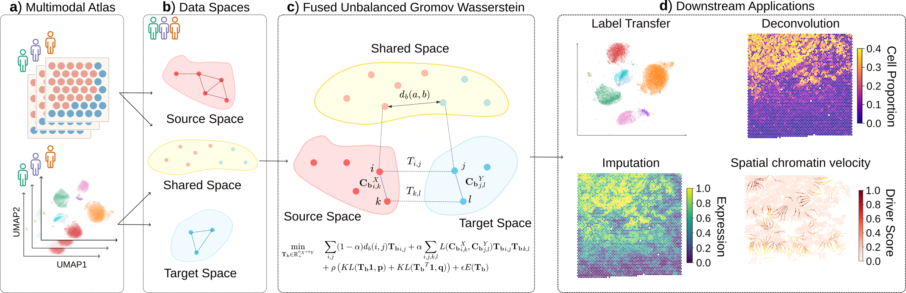

# AtlasOT

AtlasOT - The Fused Unbalanced Gromov Wasserstein for Multimodal Integration of Disease Atlases

AtlasOT aligns two modalities (RNA / ATAC / spatial) with a Fused Unbalanced
Gromov-Wasserstein (FUGW) transport plan, and uses that plan for **label
transfer**, **gene imputation**, **spatial deconvolution** and **spatial chromatin velocity**.

<p align="center">
  
</p>

---

## Installation

Requires Python 3.10 and a Linux machine (a CUDA GPU is optional but strongly
recommended for datasets above a few thousand cells).

```bash
git clone https://github.com/CostaLab/AtlasOT.git

cd AtlasOT

conda create -n atlasot python=3.10 -y

conda activate atlasot

pip install .
```

A patched copy of [`fugw`](https://github.com/alexisthual/fugw) is bundled in
`fugw/` and installed automatically — it adds the custom cross-modality cost
matrix (`M`) and Laplacian regularization (`L`) that AtlasOT relies on, so do
**not** replace it with the PyPI release of `fugw`.

Check the installation:

```python
import atlasot as aot
print(aot.__version__)
```

---

## Tutorials

Two end-to-end notebooks live in [`tutorial/`](tutorial/):

| Notebook | Task |
|---|---|
| [`atlasot_tutorial.ipynb`](tutorial/atlasot_tutorial.ipynb) | **RNA → ATAC label transfer** — preprocessing, shared space, transport plan, transferring cell-type labels |
| [`atlasot_rna_spatial_tutorial.ipynb`](tutorial/atlasot_rna_spatial_tutorial.ipynb) | **RNA → spatial gene imputation** — imputing unmeasured genes onto tissue, plus deconvolution and dominant-cell-type maps |

A minimal RNA → spatial run looks like this:

```python
import muon as mu
import atlasot as aot

m = mu.read_h5mu("sample.h5mu")
rna, sp = m['gene_expression'].copy(), m['spatial'].copy()

# 1. Preprocess and reduce
rna = aot.reduction_rna(aot.preprocess_rna(rna))
sp = aot.reduction_rna(aot.preprocess_rna(sp))

# 2. Shared space across common genes
common = list(set(rna.var_names) & set(sp.var_names))
rna.obsm['shareSpace'], sp.obsm['shareSpace'] = aot.find_shared_space(common, rna, sp)

# 3. Cost matrices
M = aot.cosine_distance_tensor(rna.obsm['shareSpace'], sp.obsm['shareSpace'])
rna.obsp['cost_matrix'] = aot.compute_geodesic_distance(rna.obsm['RNA_pca_l2_norm'], k=30)
sp.obsp['cost_matrix'], adj = aot.compute_spatial_geodesic(
    sp.obsm['spatial'], sp.obsm['RNA_pca_l2_norm'], k_phys=15)

# 4. Transport plan, then impute
pi = aot.scFUGW_RNA_Spatial_with_cost(
    target=sp, source=rna, M=M, alpha=0.5, rho=1.1, eps=1e-2).cpu().numpy()

imputed = aot.gene_imputation(pi, rna)
imputed = aot.graph_smooth_results(imputed.values, adj, alpha=0.6, n_iter=2)
```

Full function reference: [`docs/API.md`](docs/API.md).
Hyperparameter guidance (`alpha`, `eps`) per task: [`AI-README.md`](AI-README.md).

---

## Citation

If you use AtlasOT in your research, please cite:

<!-- TODO: fill in once the paper is out -->

```bibtex
@article{atlasot,
  title   = {TBD},
  author  = {Peng, Kai and others},
  journal = {TBD},
  year    = {TBD}
}
```

---

## License

MIT — see [`LICENSE`](LICENSE). The bundled `fugw/` fork keeps its original
license and attribution.
